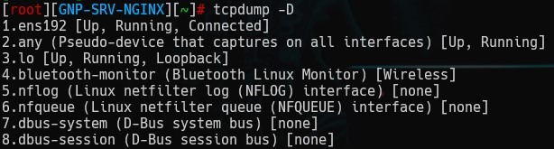
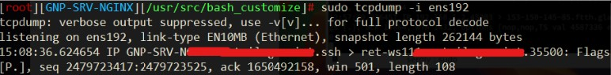

---                           
title: 'TCPdump'        
published: true               
visible: true                 
media_order: '01.jpg'

---                        

### Установка TCPdump

В большинстве дистрибутивов tcpdump уже установлен, но если его нет в системе, то можно легко установить.  
Debian/Ubuntu:  
```bash
sudo apt install tcpdum
```
CentOS/Rocky Linux/Red Hat:  
```bash
sudo yum install tcpdump
или
sudo dnf install tcpdump
```
***

### Основные параметры команды

Применяется следующий формат записи команды:
```bash
tcpdump опции -i интерфейс фильтры
```
Основные опции:
- `-A` - выводить все пакеты в формате ASCII;
- `-c` - закрыть программу после перехвата n-ого количества пакетов;
- `-C` - при записи пакетов в файл, проверять размер файла, и если он больше заданного - создать новый файл;
- `-D` - вывести список доступных сетевых интерфейсов;
- `-e` - выводить информацию уровня соединения для каждого пакета, это может быть полезно, например, для отображения MAC адреса;
- `-f` - выводить доменное имя для ip адресов;
- `-F` - читать пакеты из файла, а не интерфейса;
- `-G` - создавать новый файл лога через указанный промежуток времени;
- `-H` - обнаруживать заголовки 802.11s;
- `-i` - имя интерфейса для перехвата пакетов. Вы можете захватывать пакеты со всех интерфейсов, для этого укажите any;
- `-I` - переключить интерфейс в режим монитора для захвата всех проходящих пакетов;
- `-j` - установить формат Timestamp для записи пакетов;
- `-J` - посмотреть доступные Timestamp;
- `-K` - не проверять контрольные суммы пакетов;
- `-l` - добавить поддержку прокрутки к выводу;
- `-L` - вывести поддерживаемые протоколы подключения для интерфейса;
- `-n` - не отображать доменные имена;
- `-r` - прочитать пакеты из файла, созданного с помощью -w;
- `-v`, `-vv`, `-vvv` - более подробный вывод;
- `-q` - выводить минимум информации;
- `-w` - записать вывод в файл;
- `-Z` - пользователь, от имени которого будут создаваться файлы.  
Для подробной информации можно почитать `man tcpdump`

***

### Список интерфейсов для использования

```bash
sudo tcpdump -D
```



***

### Захват всех пакетов на интерфейсе

```bash
sudo tcpdump -i eth0
```
После ввода команды начнется захват пакетов на указанном интерфейсе


